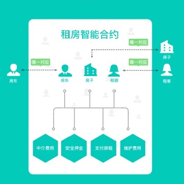
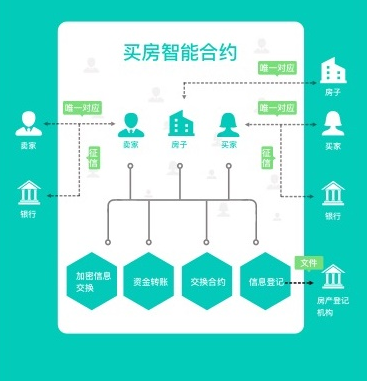
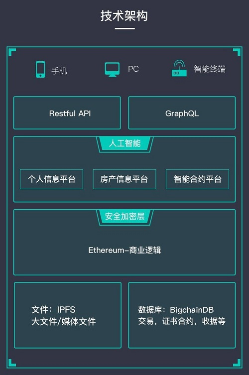
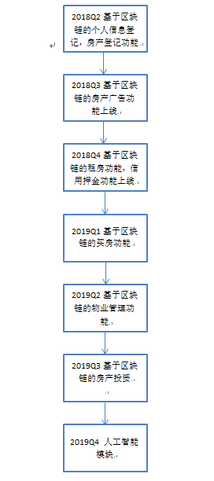

# Trusted Property Protocol 白皮书
                          
## 1．背景

在2005年，尼克萨博描述了复制数据库技术的发展使基于区块链的系统可以应用于登记土地所有权，创建包括例如房产权等概念的详细框架。

2009年，随着中本聪比特币系统的去中心化共识开发成功，许多区块链的其它应用开始快速出现。以太坊被称作区块链2.0，它是基于脚本、竞争币和链上元协议对区块链进行了整合和提高，使得开发者能够快速的创建任意的基于共识的、可扩展的、标准化的、特性完备的、易于开发的和协同的应用。

以太坊通过建立抽象的、内置有图灵完备编程语言的区块链基础层，使得任何人都能够创建智能合约和去中心化应用，并在其中设立他们定义的所有权规则、交易方式和状态转换函数等。智能合约是一个包含价值而且只有满足某些条件才能打开的加密盒子，它能在以太坊的平台上创建，并且因为智能合约具有图灵完备性、价值知晓、区块链知晓和多状态所增加的力量，而比比特币脚本所能提供的智能合约强大得多，这就为基于以太坊的房地产应用的蓬勃发展提供了必要的基础。

## 2. 问题

根据太平洋戴维斯世界研究发布的《2016全球不动产交易之趋势》，全球不动产总值接近217万亿美元，占全球所有主流资产价值的60%以上，约相当于全球GDP的2.7倍。其中，2016年一年中国房地产行业全年商品房成交金额达到了11.7万亿元。

但是，由于房地产的信息非常不透明，虚假信息大大多于真实信息，为了验证信息的真伪，需要大量的工作，造成房地产交易时间过长，交易费用过高。在房产租赁和买卖交易过程中，因为房屋产权信息虚假产生的欺诈也经常发生，对买卖双方都可能造成巨大损失；这些问题不仅在大多数发展中国家出现，在发达国家中也不可避免。特别的，随着国际化进程愈演愈烈，在跨国房产交易中，因为地域，语言和文化的差异，获取房屋产权信息更加困难，使交易的过程更加漫长的，交易欺诈更加频繁。

我们发现，在房产交易和租赁的流程中，发达国家或地区都使用中心化的产权登记系统来维护当地的房地产信息登记、处理当地房产之间的转让，这些中心化的方式在处理房产所有权转移过程中，因为信息被垄断，买方特别容易因为无法获得全面的房屋产权人和产权的信息的虚假而受到欺诈；即使房屋产权和产权人信息真实，但交易过程非常复杂及费时，费用很高，致使交易双方的客户体验都比较差。同样的，在房产租赁过程中，因为虚假的房产产权人和产权信息造成的损失更加普遍。尤其在中介参与的人工交易流程中，会产生很多不规范的操作和诚信风险，损坏交易双方和中介的利益，这就需要有一套能严格执行各方需求的智能合约来执行交易流程。

产生这些问题的根本原因是，目前还没有一个网络平台可以让房地产投资者和租赁者可靠地查询、登记和记录房地产的所有权和产权人信息，并通过方便快捷的方式支付费用，缴纳交易定金、押金及中介费，签订智能合约等功能。

## 3．解决方案

Tursted Property Protocol团队在多年的区块链和地产行业经验的基础上，率先提出了区块链+智能合约+房地产的颠覆性创新，必将极大提高房地产的信用体系，提升房地产交易的便利性和流动性。

区块链是一种去中心化的数据库账本，它包含一张被称为区块的列表，有着持续增长并且排列整齐的记录。每个区块都包含一个时间戳和一个与前一区块的链接。区块链具有以下特点：

* 去中心化

由于使用分布式核算和存储，不存在中心化的硬件或管理机构，任意节点的权利和义务都是均等的，系统中的数据块由整个系统中具有维护功能的节点来共同维护。

* 开放性

系统是开放的，除了交易各方的私有信息被加密外，区块链的数据对所有人公开，任何人都可以通过公开的接口查询区块链数据和开发相关应用，因此整个系统信息高度透明。

* 自治性

区块链采用基于协商一致的规范和协议（比如一套公开透明的算法）使得整个系统中的所有节点能够在去信任的环境自由安全的交换数据，使得对“人”的信任改成了对机器的信任，任何人为的干预不起作用。

* 信息不可篡改

一旦信息经过验证并添加至区块链，就会永久的存储起来，除非能够同时控制住系统中超过51%的节点，否则单个节点上对数据库的修改是无效的，因此区块链的数据稳定性和可靠性极高。

* 匿名性

由于节点之间的交换遵循固定的算法，其数据交互是无需信任的（区块链中的程序规则会自行判断活动是否有效），因此交易对手无须通过公开身份的方式让对方自己产生信任，对信用的累积非常有帮助。

2014年以太坊(Ethereum) 智能合约平台开始崛起，它除了拥有比特币的分布式账本功能外，以太坊区块链还支持“智能合约”(smart contracts)，即可以自动执行存储在区块链中的复杂交易；以太坊还支持创建DApps， DApp是一个分布式应用程序，其全部或部分后端代码可以在具有用户界面的分布式账本上运行，以促进智能合约和区块链代码的交互。 

因此，区块链智能合约为管理房地产交易提供了一种非常有潜力的解决方案，该方案无需信任一个中心化的第三方机构，仅需要引入通用的区块链智能合约即可解决房地产交易过程中的众多问题。

TPP（Trusted Property Protocol）的团队将使用区块链智能合约为基础，利用不可篡改的产权信息特性，去中心化的交易机制，智能合约的资产处置等优势，结合了云计算、大数据、人工智能和支付行业的解决方案，全力打造一个可信任的、去中心化的房产产权交易平台。该平台允许每个用户角色（包括经纪人、买家、卖家，出租方，承租方和所有者的代理人/公证人，投资者，登记机构）通过TPP实现可信任房地产的租赁及交易，以解决全球房地产交易面临的产权欺诈问题，并提高交易的安全性和交易的效率。

## 4. 商业模式 

TPP的智能合约主要体现在两个方面：

（1）租房智能合约模式

TPP租房智能合约致力创建全球统⼀的租赁程序标准，允许房东和租户以平等的⽅式在线完成发现，信任，定金支付等租赁流程：

a. 房东在DApp中登记要出租的房屋，租客在DApp中找寻找符合他标准要求的房屋，双方需提供KYC证明文件；

b. 线下查看等流程执行；

c. 租客通过智能合约向卖方提交押金（以太坊支付），智能合约将触发租客的支付系统进行加密支付（以太坊支付）；

d. 智能合约接受付款后，合同生效；

e.租期结束后，如果房东没有提出损坏索赔，智能合约会返还押金给租客，如果房东提出损坏索赔，智能合约会在租客同意的情况下把赔偿转入房东的钱包。

（2）买房智能合约模式

TPP买房智能合约流程：

a. 卖家在DApp中登记要出售的房屋，买家在DApp中找寻找符合他标准要求的房屋，买卖双方
需提供KYC证明文件；

b. 买家通过智能合约向卖方提交购买定金（以太坊支付），卖家通过签署数字签名方式接受报价；

c. 中介机构按照双方提供的智能合约和其他要求检查执行；

d. 一旦满足上述条件，智能合约将触发买方的支付系统进行加密支付（以太坊支付）；

e. 智能合约接受付款后，双方去政府登记机构完成产权登记。

（3）应用模块

•	个人信息验证

在租房和买房过程中银行，交易双方都必须获取关于交易双方的私密信息，比如什么身份，住址，收入状况，无犯罪记录，信用记录。传统的房产交易过程中，这是一个重复性的工作，而且可能是通过传统的非数字化的方式来实现, 因此很费事而且容易出错。DApp个人信息模块数字化了这个流程，用户可以把自己的私密信息放在DApp上，DApp不缓存数据，仅在用户授权的情况下，有选择的把相关信息提供给相关部门或个人。

•	产权信息验证

在租房和买房过程中银行，交易双方都必须获取关于交易房产产权信息，比如地址，面积，建造记录，抵押信息等。传统的房产交易过程中，这是一个费事而且容易出错的过程。TPP房屋产权信息模块数字化了这个流程，所有者可以把房产的产权信息放在TPP平台上，可以有选择的把相关信息提供给相关部门或个人。

•	智能合约

在租房过程中，房东，租客和中介，三方同时签名一个智能押金合约。押金存在区块链上，不在房东手中，也不在中介手中。退押金的时候如果房东和房客都签名，无须中介人参与；如果有冲突，由中介裁决。在房产买卖的押金，也同样可以用智能押金合约来解决。

•	房产投资

通过智能合约和区块链，一个房产可以被拆分为很多小的单元，让多个普通微投资人组成的集体来共有。对于房产的经营和买卖可以通过区块链上的投票来决策。

•	房产保险

通过智能合约和区块链，可以把众多房东的保险费集中到一起，建立起强大的经济后备，可以为遭受损失的房产提供必要的资金补偿，从而为房地产资金的正常运用提供良好的条件。

(4)TPP的使用

1.通过奖励Token的方式，鼓励用户上传身份信息和房产信息，发布出租或出售房屋的信息，用户可以在其他场景中使用这些代币。

2.房地产开发商购买TPP作为广告费，在DApp发布不可篡改的房地产信息，然后向浏览房地产信息的真实客户发放注意力奖励，通过TPP支付。

3. 当在租赁或购买某个房产时，使用Token向交易方和房地产经纪人支付交易的费用，可以享受比现金支付折扣的优惠，并在适合的地区通过加密货币的形式支付房租。

4.推荐好友注册DApp，将会获得代币奖励，而且永远享受到好友租赁或买卖房屋的中介费提成，通过Token支付。

5. 通过添加评价，获得Token，并利用不可篡改的评价信息影响交易对手的信用评级。

TPP未来的发展计划是通过去中心化，去中介化的方式消除现有房产交易中存在欺诈现象，并降低交易费用，缩短交易时间。TPP会拿出一定比例的盈利来回购代币，来回馈整个生态的发展。

TPP将不断实施新的解决方案，并持续在各大主要房地产市场上进行应用推广，包括但不限于产权调查，短期租赁，长期租赁，信用押金，房产买卖，抵押贷款，资产证券化等服务。 TPP的最终目标是使房地产相关的每一个交易步骤都可以通过区块链的智能合约来执行。

## 5. 技术方案

TPP平台是一个独立的去中心化的P2P平台，平台运行为房地产行业量身定做的智能合约。

(1). 平台的设计理念

•	最大限度去第三方
因为TPP平台是基于区块链的技术，传统交易中不可缺少的提供信任的第三方可以被去除。我们相信随着区块链技术进入主流，第三方可以完全去除。但是由于现有的法律法规，第三方不可能完全被去除。我们采取渐进式的模式，逐步去除。这样能够在尽快落地运营的同时依然达到降低交易成本，缩短交易时间的目的。

•	真实性
TPP对比传统平台的另一大优势是能够提供真实的不可修改的信息。平台上的信息通过多方认证确保真实，区块链保证信息不会被篡改。

•	私密性
房产信息作为个人资产具有隐私性。TPP平台上的信息为用户自己所有。平台充分确保信息私密性，只有在所有者允许的情况下安全有选择的透露给其他用户。此外平台上的计算通过使用Enigma协议，可以确保存储在每一个节点上的信息的安全和私密性。

•	智能性
TPP平台使用基于人工智能深度学习的专家系统来完成海量数据分析归类，自然语言处理，信息真伪识别等通常需要大量人力的冗繁工作。

•	DAG系统提高系统性能增加用户体验
随着TPP平台交易量的不断增加，范围不断扩大，单链的区块链系统终将发生拥塞，为解决此问题，TPP将扩展为基于DAG的系统。DAG全称是“有向无环图”，在DAG系统中，每个用户都可以提交一个数据单元，数据单元里可以有交易、消息等信息。数据单元间通过引用关系链接起来，从⽽形成具有半序关系的DAG（有向无环图）。DAG的特点是把数据单元的写入操作异步化，大量客户端可以自主异步地把交易数据写⼊DAG，从而可以支持极大的并发量和极高的速度性。

•	嫁接
TPP支持嫁接，即通过⼀⼀映射关系，将其他公链的地址和公钥对应到TPP地址上，从而其他公链的用户通过简单的地址登记和转换，就可以映射一个TPP地址并使用。

•	原生跨链支持
对于区块链通信的孤岛状态，目前已经出现了⼀些跨链概念验证并取得了实质性的进 展。而另一方面，区块链系统本身需要为跨链技术提供更简便的对接，更好的支持，进而实现原生跨链。TPP将为跨链技术实现通用协议与接入，为链间通信和交易提供了原生支持。从而使链与链之间简便的通信和链间协作的便捷开发成为可能。

•	链群
通过DAG，嫁接和原生跨链支持，TPP将实现进一步去中心化的链群结构，使各类区块链网络形成一个信息和价值互联互通，互相协作的大链群系统，区块链的孤岛形态将得以消融。

•	激励机制
TPP平台会对于提供优质信息，点评好的用户提供奖励。激励机制由智能合约来实现，激励的方式包括直接奖励代币，交易费折扣。

(2). 平台基本模块组成

•	房产地权登记
房产信息包括与法律密切相关的地契，房产所有权信息。同时也会包括普通数据和图片。

•	个人信息登记
个人信息包括能作为法律依据的身份信息，包括身份证，护照。同时也包括普通数据。

•	智能合约引擎
智能合约引擎用于设立管理智能合约。支持多重签名，环签名，不可修改合约。

•	人工智能模块
人工智能模块用于识别虚假信息，分析海量数据。未来可依靠人工智能与区块链的结合支持更多不同形式的房产所有形式，已经房产租赁使用的方式。

(3). 技术栈

•	solidity/vyper智能合约

•	谷歌TensorFlow深度学习

•	python后端api

•	reactjs前端网站

•	react native移动app

(4). 系统架构图

 

## 6. 产品规划

                        

## 7. 生态规划和社区治理架构

TPP社区将由设立在新加坡的基金会进行管理。该机构作为TPP社区的法律主体，将全权负责TPP的技术开发、业务推广、社区运营，并且承担所有 TPP的法律责任。

为了确保整个 TPP社区在公开透明的状态下高效运行，将设立基金委员会（以下简称基金会），在基金委员会下，设立有基金会最高决策机构——决策委员会，管理基金会旗下各个执行机构，有权决定基金会资金使用、冻结、奖励、惩罚等，决策委员会成员由社区选举产生。决策委员会任期为 2 年，在任期满后，将由TPP社区选举产生。 

决策委员会下设立 5个执行机构：

* 业务委员会——负责业务推广、商业拓展、生态搭建等。

* 技术委员会——负责技术开发管理、代码开源管理、Github 开源代码维护、社区技术更新评估等，成员一般由国内外区块链技术专家担任。 

* 社区委员会——国内外社区运营和管理、国内外社区活动策划、 国内外社区资源对接、社区奖励发放、社区惩罚执行。成员一般由社区活跃成员担任。 

* 公共关系委员会——负责项目进展通报、公关问题处理、对外宣传等，成员一般由 TPP签约公关公司代表担任。 

* 人事财务委员会——负责基金会成员的日常补贴发放、正常财务支出、志愿者招募等。

执行机构责任人——决策委员会成立后会任命各个执行机构的负责人，负责人将承担相关业务职能下的运营管理、个人机构间的工作协调，负责人定期需向决策委员会汇报工作。

核心团队成员：

Cliff Xuan  
伦敦大学皇后学院硕士，在英国工作15年间，曾领导开发数千万英镑的网络平台，他是专注于发展英国数字经济的创新机构Digital Catapult的首位软件工程师，负责知识产权的区块链研发工作

Peter Li
伦敦大学网络计算硕士，曾在花旗银行，中国平安和多个互联网金融公司担任高管， 负责互联网金融和区块链产品和研发工作，并创立房地产租赁互联网平台

Jason Li
UCL硕士毕业，博士在读期间被德意志银行聘用，后在美银美林，JP摩根的多伦多，纽约，香港办公室从事技术管理工作，领导研发团队通过区块链技术改造银行的业务

Susan Maddison
市场总监 曾任维珍媒体，美国安泰保险金融集团高管，负责公司全球项目的开发和管理

Zheng Zhu
伦敦大学计算机博士，牛津大学数据科学实验室研究员，目前专注于通过网络分析和深度学习算法建立欺诈检测模型和收益优化。

Sarah Yan
业务发展总监 多年房地产行业经验，曾任SOHO中国销售总监

顾问团队：

Bertrand Nouvel
里昂高等师范计算机博士，WIDE IO 创始人，专注于投资区块链项目

Richard Su
全球知名软件公司MVP，在系统开发和运维方面有超过13年工作经验。

Geoge Yuan 
复旦大学法律系博士后，曾任职上海浦东金融办，华宝信托，锦天城律所合伙人。

Aaron Choi
毕业于UCSD， 比特币中国 国际业务副总裁 BTCC  VP International Business 

## 8. 分配计划

项目代币：100亿

预售及基石投资人：10% （30%锁定6个月，30% 锁定12个月； 最低购买限额：50ETH）

私募及机构投资：30%（30%锁定6个月，30% 锁定12个月；最低购买限额：50ETH）

基金会持有：20% 

创始团队：20%

生态激励及技术发展：20%

• 基金会，创始团队、生态激励及技术发展持有的代币锁定3个月，归转期为24个月，每季度转归12.5%。 从Token Sale结束起开始计算。 

## 9.投资机构

### 欧洲区块链协会

### 英创基金

### 璞聚资本

### 遂真投资

## 10. 免责声明
本文档只用于传达信息之用途，并不构成买卖项目数字资产的相关意见。任何类似的提议将在一个可信任的条款下并在可应用的证券法和其他相关法律允许下进行，以上信息或分析不构成投资决策或具体建议。 

本文档不构成任何关于证券形式的投资建议，投资意向或教唆投资。 本文档不组成也不理解为提供任何买卖行为，或任何邀请买卖、任何形式证券的行为，也不是任何形式上的合约或者承诺。 

本文档中所有的收益和利润举例仅为展示目的，或代表行业平均值，并不构成对用户参与结果的保证。 TPP明确表示相关意向用户明确了解TPP平台的风险， 投资者一旦参与投资即表示了解并接受该项目风险，并愿意个人为此承担一切相应结果或后果。 

TPP 明确表示不承担任何参与 TPP 项目造成的直接或间接的损失包括: 
(i) 本文档提供所有信息的可靠性 
(ii) 由此产生的任何错误，疏忽或者不准确信息 
(iii) 或由此导致的任何行为。 

TPP 是以 TPP 平台为其使用场景之一的数字 Token，TPP不是一种投资。我们无法保证 TPP 将会增值，其也有可能在某种情况下出现价值下降。鉴于不可预知的情况，本白皮书列出的目标可能发生变化。虽然团队会尽力实现本白皮书的所有目标，但所有购买 TPP 的个人和团体将自担风险。 

## 11. 风险提示

数字资产投资作为一种新的投资模式，存在各种不同的风险， 潜在投资者需谨慎评估投资风险及自身风险的承受能力: 

* 1、Token 销售市场风险   由于 Token 销售市场环境与整个数字货币市场形势密不可分，如市场行情整体低靡，或存在其他不可控因素的影响，则可能造成 Token本身即使具备良好的前景，但价格依然长期处于被低估的状态。 

* 2、监管风险   由于区块链的发展尚处早期，在内全球都没有有关 ICO 过程中的前置要求、交易要求、信息披露要求、锁定要求等相关的法规文件。并且目前政策会如何实施尚不明朗，这些因素均可能对项目的投资与流动性产生不确定影响。而区块链技术已经成为世界上各个主要国家的监管主要对象，如果监管主体插手或施加影响，则 TPP 应用或 TPP 可能受到其影响，例如法令限制使用、 销售 Token，有可能限制、阻碍甚至直接终止 TPP 应用和 TPP 的发展。 

* 3、竞争风险   随着信息技术和移动互联网的发展，以“比特币”为代表的数字资产逐渐兴起，各类去中心化的应用持续涌现，行业内竞争日趋激烈。但随着其他应用平台的层出不穷和不断扩张，社区将面临持 续的运营压力和一定的市场竞争风险。  

* 4、人员流失风险   TPP集聚了一批在各自专业领域具有领先优势和丰富经验的技术团队和顾问专家， 其中不乏长期从事区块链行业的专业人员以及有丰富互联网产品开发和运营经验的核心团队。核心团队的稳定和顾问资源对 TPP 保持业内核心竞争力具有重要意义。核心人员或顾问团队的流失，可能会影响平台的稳定运营或对未来发 展带来一定的不利影响。 

* 5、资金匮乏导致无法开发的风险   由于创始团队筹集的 Token 价格大幅度下跌或者开发时间超出预计等原因，都有可能造成团队开发资金匮乏，并由此可能会导致团队极度缺乏资金，从而无法实现原定开发目标的风险。 

* 6、私钥丢失风险   购买者的 TPP在提取到自己的数字钱包地址后，操作地址内所包含内容的唯一方式就是购买者相关密钥(即私钥或是钱包密码)。 用户个人负责保护相关密钥，用于签署证明资产所有权的交易。用户理解并接受, 如果他的私钥文件或密码分别丢失或被盗, 则获得的与用户帐户 (地址) 或密码相关的 TPP 将不可恢复, 并将永久丢失。最好的安全储存登录凭证的方式是购买者将密钥分开到一个或数个地方安全储存，且最好不要储存在公用电脑。 

* 7、黑客或盗窃的风险   黑客或其它组织或国家均有以任何方法试图打断 TPP 应用或功能的可能性， 包括但不限于拒绝服务攻击、Sybil 攻击、 游袭、恶意软件攻击或一致性攻击等。 

* 8、未保险损失的风险   不像银行账户或其它金融机构的账户，存储在 TPP 账户或相关区块链网络上通常没有保险保障，任何情况下的损失，将不会有任何公开的个体组织为你的损失承保。 

* 9、核心协议相关的风险   TPP 平台目前基于以太坊开发，因此任何以太坊发生的故障，不可预期的功能问题或遭受攻击都有可能导致 TPP 或 TPP 平台以难以预料的方式停止工作或功能缺失。 

* 10、系统性风险   开源软件中被忽视的致命缺陷或全球网络基础设施大规模故障造成的风险。虽然其中部分风险将随着时间的推移大幅度减轻，比如修复漏洞和突破计算瓶颈，但其他部分风险依然不可预测，比如可能导致部分或全球互联网中断的政治因素或自然灾害。 

* 11、漏洞风险或密码学加速发展的风险   密码学的加速发展或者科技的发展诸如量子计算机的发展，或将破解的风险带给 TPP 平台，这可能导致 TPP 的丢失。 

* 12、应用缺少关注度的风险   TPP 应用存在没有被大量个人或组织使用的可能性，这意味着公众没有足够的兴趣去开发和发展这些相关分布式应用，这样一种缺少兴趣的现象可能对 TPP 和 TPP 应用造成负面影响。 

* 13、不被认可或缺乏使用者的风险   首先 TPP 不应该被当做一种投资，虽然 TPP 在一定的时间后可能会有一定的价值，但如果 TPP 不被市场所认可从而缺乏使用者的话，这种价值可能非常小。有可能发生的是，由于任何可能的原因，包括但不限于商业关系或营销战略的失败，TPP 平台和所有的众售资金支持的后续营销将不能取得成功。如果这种情况发生，则可能没有这个平台就没有后续的跟进者或少有跟进者，显然， 这对本项目而言是非常不利的。 

* 14、应用存在的故障风险   TPP平台可能因各方面可知或不可知的原因故障(如大规模节点宕机)，无法正常提供服务，严重时可能导致用户 TPP 的丢失。 

* 15、应用或产品达不到自身或购买者的预期的风险   TPP 应用当前正处于开发阶段，在发布正式版之前可能会进行比较大的改动，任何 TPP 自身或购买者对 TPP 应用或 TPP 的功能或形式(包括参与者的行为)的期望或想象均有可能达不到预期，任何错误地分析，一个设计的改变等均有可能导致这种情况 的发生。 

* 16、无法预料的其它风险   基于密码学的 Token 是一种全新且未经测试的技术，除了本白皮书内提及的风险外，此外还存在着一些创始团队尚未提及或尚未预料到的风险。此外，其它风险也有可能突然出现，或者以多种已经提及的风险的组合的方式出现。
