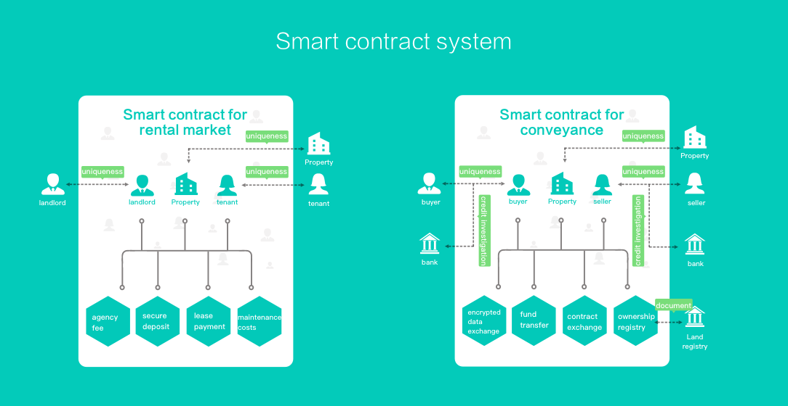
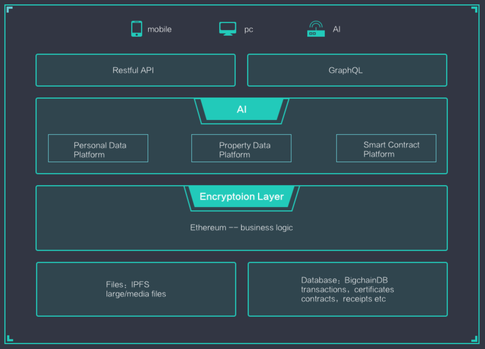
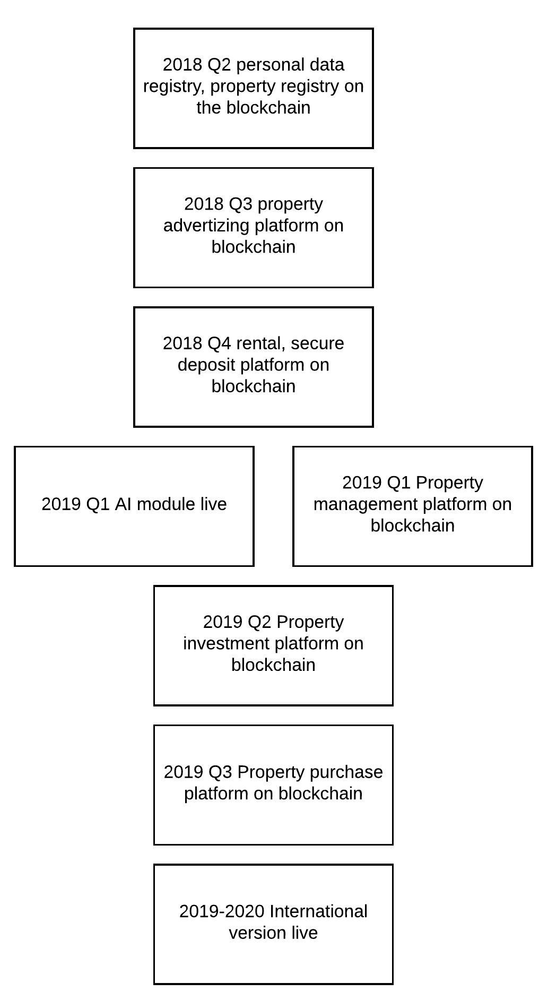

# Trusted Property Token White Paper

## 1. Background

As early as 2005, Nick Szabo described how “new advances in replicated database technology” can be used as registry for ownership of land. This was ahead of its time, and an effective replicated database system did not appear until 2009, when Satoshi Nakamoto created Bitcoin. Bitcoin was designed as a decentralized peer-to-peer digital currency, but the idea of recording the transactions in a public ledger called blockchain was found useful for other use cases.

In 2015, Ethereum was released as an open-source, public, blockchain-based distributed computing platform. Considered as blockchain 2.0, Ethereum is not only a currency system, but a Turing-complete operating system featuring smart contract functionality. This paved a solid foundation for blockchain based applications for real estate to thrive including land ownership registry, security deposit, micro-investment, etc.

## 2. The Problem

According to Around the World in Dollars and Cents 2016 by Savills, the global real estate market is at a staggering amount of $217 trillion, accounting for more than 60% of all  mainstream assets and 2.7 times the world’s GDP. In the same year, the annual turnover of real estate industry in China reached $1.84 trillion. 

As property ownership is complex and often kept private, fake or inaccurate information is found everywhere, and verification is difficult and laborious. This results in real estate transaction taking too long, and costs too high. In addition, during the real estate transactions including both leasing and purchasing, fraud due to false information also frequently occurs, which can cause huge losses to both buyers and sellers. These problems not only exist in developing countries but also in developed countries. Furthermore, globalization boosted cross border real estate transactions. Because of the geographical, linguistic and cultural differences of different parties, the problems are only getting worse.

We find that in the real estate buying process, the developed countries all use a centralized property ownership registry. These centralized and monopolized systems are inefficient and the data is often incomplete and ambiguous, as a result the deep involvement of a solicitor is necessary, leading to high transaction fees. The buying process is very complicated and time-consuming also because of repeated exchange of personal and property data between all parties including banks and solicitors on both sides of the transaction. As a result, the customer experience on both sides is rather poor. In the case of leasing, the process is often over simplified due to cost concern, which in turn leads to rental fraud. One solution is to use an intermediary such as a real estate agency. However, this will increase the cost, some of which might even be hidden, and yet there is not enough enforcement to protect either side when the counter party   breaches the contract.

All these problems can be solved by a software platform on the Internet utilizing the blockchain and smart contracts, which allows real estate investors, sellers, landlords and renters to reliably query, securely register and update real estate ownership, and also to pay for transactions, deposits, and all other fees in a safe and easy way.

## 3. The Solution

Trusted Property team pioneer the disruptive innovation of applying blockchain and smart contract in real estate transactions. Their work is based on years of experience in blockchain and real estate industry. It will greatly enhance the credit system in real estate, improve the speed of transaction process, as well as the liquidity of real estate assets.

A blockchain is a digitized, decentralized, public ledger of all cryptocurrency transactions. Constantly growing as ‘completed’ blocks are recorded and added to it in chronological order. Each block contains a timestamp and a link to the previous block. This allows participants to keep track of transactions without central record-keeping. 

A blockchain has the following characteristics:

* Decentralized

Due to the use of distributed accounting and storage, there is no centralized hardware or management mechanism. The rights and obligations of any node are equal. The data blocks in the system are jointly maintained by the nodes with the maintenance functions in the whole system.

* Open

The system is open, except for the proprietary information of parties involved in the transaction is encrypted, the data of the blockchain is open to everyone. Anyone can query the blockchain data and develop related applications through a public interface, so the entire system information is highly transparent.

* Autonomous

The blockchain uses consensus-based protocols and standards, such as a set of open and transparent algorithms, that allow all nodes in the entire system to exchange data freely and securely in a trusted environment. In other words, the trust in the system is based on mathematics and cryptography, therefore human intervention does not work.

* Immutable

Once the information is validated and added to the blockchain, it will be stored forever, unless it is possible to control more than 51% of the nodes in the system at the same time. Modification to the database at a single node is not valid, so blockchain’s stability and reliability is extremely high.

* Pseudonymous

Since the exchange between nodes follows a fixed algorithm, the data exchange is trustless (the rules of the program in the blockchain determine whether the activity is valid), so the counter-party does not need to trust the other party in an open manner.

Ethereum does not only have the distributed ledger as Bitcoin, it also support smart contracts, which automatically execute complex program stored on the blockchain. Ethereum also facilitates the creation of decentralized application abbreviated as DApp. All or part of DApp’s backend code is run on the blockchain with frontend code and user interfaces written in any language (just like an app) that can make calls to the backend. Furthermore, its frontend can be hosted on decentralized storage such as IPFS. 

Therefore, smart contracts provide a very promising solution to the management of real estate transactions without the need to trust a centralized third-party institution. With the introduction of smart contracts many problems in the real estate transaction process can be solved.

Through smart contract on blockchain, the TPT (Trusted Property Token) team will take advantage of the immutable property ownership information, decentralized transaction mechanism, in combination with cloud computing, big data, artificial intelligence and solutions from mobile payment system, to create a credible, decentralized real estate property trading platform. The platform is for all participants in a property leasing and buying process, including brokers, buyers, sellers, lenders, tenants, owners, investors, and registrars. This will solve the problem of fraud, and improve transaction security and efficiency.

## 4. Business Model

TPT's smart contracts are used in both renting and buying.

### Use cases

* Decentralized personal data verification

In buying and sometimes renting, banks, solicitors, and property registries must verify private personal data about both buyers and sellers. These include personal identity, residential address, income status, no criminal record, and credit history. In a conventional transaction, this is a repetitive task, and quite often done in a traditional, non-digital way, therefore it is cumbersome and error-prone. TPT personal information module digitizes this process. The user can put their own private information on the DApp, and the DApp does not send the data to any central database nor any third party. Only when it is authorized by the user, it is shared with relevant parties or individuals.

* Decentralized property data verification

Same as personal data, TPT property data module digitizes the process of property data exchange. Again it is stored on the DApp and isn’t shared unless authorized by the user. Even when it is shared, depending on the circumstance, it can take advantage of zero-knowledge proof, in order to provide sufficient proof yet without revealing the data.

* Secure Deposit

Create an escrow transaction, which needs two signatures from three people, the landlord, the tenant and a randomly chosen person or one trusted by both. The deposit is on the blockchain, so it's not withheld by any of the three. When it is the time to release the deposit, it only needs the landlord and the tenant if there is no dispute. The third person can mediate only when dispute occurs.

* Micro Investment

Using smart contract, ownership of one property can be split into multiple shares purchased by a group of individuals. Decisions on the shared property can be made through votes on the blockchain.
Usage of TP Token

* Incentives for users

Tokens are rewarded to encourage users to upload identity and real estate information, publish information about renting or selling houses. They can spend the tokens for other services or exchange them for fiat or cryptocurrency in an exchange.

* Advertising fee for real estate agencies

Real estate developers buy TPT in the same way as they would pay advertising fee. They post real estate information on DApp, and then pay real customers who view real estate information for their attention using TPT.

* Currency to pay for properties and services

For all transactions in renting or buying a property, TPT can be used as the currency to pay landlord for the rent, seller for the property, or estate agency for service. Whenever it is used over fiat currency, discounts will be given.

* Referrals

Users are rewarded with tokens by referring friends to register and use the DApp, and the reward continues if the referred user pays for property or service using TPT tokens.

* Reviews and ratings

Users are rewarded with tokens by creating reviews and ratings to influence the counterparty credit rating. The reviews and ratings are stored as immutable data on the blockchain.

TPT's future development plan is to eliminate fraud in existing real estate transactions through decentralization and intermediation, reduce transaction costs and shorten transaction time. TPT will come up with a certain percentage of profits to repurchase tokens to repay the development of entire ecosystem.

TPT will continue to implement new solutions and promote its applications in major real estate markets including but not limited to property rights investigations, short term leases, long term leases, credit deposits, real estate sales, mortgages and asset securitizations. The ultimate goal of TPT is to digitize every real estate related transaction and run it on the blockchain.

## 5. Technical Implementation

TPT is a decentralized independent platform, which runs smart contracts specifically designed for real estate business. TPT token is an ERC20 token. The transactions on the TPT platform is paid in TPT tokens.

### Design Principles

* Maximized removal of 3rd party

As TPT is built on top of blockchain technology, the much needed 3rd parties, who provide the trust, can be removed. We believe with blockchain technology goes mainstream, all 3rd parties can be removed eventually. However, we also realise based on current law and regulation, they cannot be removed completely just yet. We are taking a progressive approach to remove 3rd parties over time, so we can make the product available to consumers sooner, in order to save the cost and time of transactions.

* Authenticity

In comparison with traditional platform, TPT provides genuine and immutable data. Data on the platform is confirmed by multiple parties to ensure authenticity. The blockchain increases accountability and promotes reliability with proper, immutable data. 

* Privacy

Property and personal data is highly private. Data on TPT platform is owned by user. The platform also provides fine grained access control. Data is securely shared only when permission is granted. Computation on the platform uses zkSNARKs, therefore correctness of the computation can be verified without having to be executed, and what was executed even does not need to be revealed.

* intelligence

TPT platform uses artificial intelligence and machine learning to perform mass data analysis and classification, natural language processing, and fraud detection, all of which is impossible with systems which depend on repetitive human effort.

* Scalability and high performance

With the constant increasing trading volume and user base on TPT platform, Single blockchain system will very likely be congested, To remove the potential performance bottleneck, DAG (Directed Acyclic Graph) system is adopted in our design. Within DAG, users can submit data unit to the system, data unit contains information like transaction and communication messages..etc. The data units are connected with each other through a relation map which forms the directed acyclic graph. DAG allows data to be asynchronizely written into the system so that the overall system throughput can be significantly improved.
 
* Interoperability

TPT supports cross-chain address mapping, i.e. address and public key on a specific blockchain can be mapped onto the TPT chain so that the address of an user on an existing blockchain can be translated to the TPT blockchain address which allows communication between users from different blockchain through TPT system.

* Openness

TPT has an open API making it easy to connect to other systems, which creates a seamless network improving value transfer.

* Incentive mechanism

TPT platform rewards users who provide high value information, or receive good reviews. Incentives are implemented in smart contracts. Rewards include free tokens or discounted transaction fees.

### Main modules

* Property Registry

Property registry includes legal information such as title deeds and ownership, as well as normal information such as facts, prices, demographics and pictures.

* Personal Information Registry

Personal data includes digital documents which can be legally used as identity and proof, such as passport, driving licence and ID card, as well as normal information such as phone number, email address, and personal preference.

* Smart Contract Engine

Smart contract engine is used to create and manage smart contract. It supports multisignature, ring signature, immutable contract.

* AI module

Artificial intelligence module is used to identify fake information, analyze large volume data. In the future the combination of artificial intelligence and blockchain can be used to support new forms of real estate ownership model as well as renting business model.

### Tech Stack

* solidity/vyper for smart contract
* TensorFlow for deep learning
* python for backend api
* reactjs for web front end
* react native for mobile app

## 6. Road Map

## 7. Ecosystem Roadmap and Community Structure

The TPT community will be managed by a foundation based in Singapore. As the legal entity of the TPT community, the organization will be fully responsible for the technical development, business promotion and community operations of TPT and assume the legal responsibility of all TPTs.

In order to ensure that the entire TPT community operates efficiently in an open and transparent manner, TPT will set up a TPT Fund Committee (hereinafter referred to as the Foundation). Under the TPT Fund Committee, there is a decision-making committee, the highest decision-making body of the Foundation. The implementing agency has the power to decide on the use, freezing, rewards, penalties, etc. of the funds of the foundation. The members of the decision making committee shall be elected by the community. The term of the policy committee is two years. After the term expires, the TPT community will be elected.

There are 5 implementing agencies under the decision-making committee:
Business Committee - TPT business promotion, business development, ecological construction and so on.
Technical Committee - TPT technology development and management, code open source management, Github open source code maintenance, community technology update assessment, members generally by the blockchain technical experts at home and abroad.
Community committees - domestic and international community operations and management, domestic and international community planning activities, domestic and international community docking resources, community reward distribution, community punishment implementation. Members are generally active members of the community.
Public Relations Committee - TPT project progress notification, public relations issues, external publicity, members generally by the TPT contracting public relations company representatives.
Personnel Finance Committee - is responsible for the daily grant of Foundation members, the normal financial expenses, volunteer recruitment and so on.

After the establishment of the Executive Committee, the decision-making committee appoints the responsible persons of each implementing agency. The responsible person will undertake the operation and management under the relevant business functions and the coordination of work among the individual agencies. The responsible person shall report regularly to the decision-making committee.

### Core Team

#### Cliff Xuan

Master Science from Queen Mary, University of London. With 15 years’ experience in software development, Cliff lead the development of multi million pounds ecommerce platform. He was the first software engineer hired by Digital Catapult, an innovation organisation created to help develop UK’s digital economy. He also served in the UK public sector when he worked for the Ministry of Justice.

#### Peter Li

Master of Science in Internet computing from University of London, Peter also has a master’s degree in investment from FuDan University. He worked as senior executives for Citi Bank, Ping An Insurance and a few other internet finance companies. He is specialized in research and development of internet finance and blockchain product.  

#### Jason Li

Master from UCL and is an enrolled PhD. Jason has worked as techleads for investment banks like Deutsche Bank，Merrill Lynch，JP Morgan in Toronto, New York, Hong Kong. Recently he is applying blockchain technology to innovate banking.

#### Susan Maddison

Marketing director Susan is an IT Director of Aetna International，Responsible for the end-to-end delivery of APAC & EMEA portfolio.

#### Dr Zheng Zhu

Dr.Zhu is Industrial Visiting Fellow at University of Oxford, Ph.D. in Computer Science from University of London

#### Sarah Yan

15 years experience in property sales, Sales Director of SOHO China

### Advisors

#### Dr Bertrand Nouvel

Dr Bertrand Nouvel is founder of WIDE IO Ltd. He received a Ph.D. in Theoretical Computer Science from École normale supérieure de Lyon.

#### Richard Su

MVP of World famous software company, 13 years experience in system development and maintenance.

#### George Yuan

Post-Doctor from Fudan University, he is a Partner of AllBright Law Offices

#### Aaron Choi

VP International Business of BTCC, graduate of UCSD

## 8. Token Distribution Plan

Project tokens: 10 billion

Pre-sale and Cornerstone Investors: 10% (30% locked for 6 months, 30% locked for 12 months; minimum purchase limit: 50ETH)

Private Equity and Institutional Investment: 20% (30% locked for 6 months, 30% locked for 12 months; minimum purchase limit: 50ETH)

Foundation holds: 25% (ecological incentives, community building and cooperation promotion)

Founding team: 20%

Going concern and technology development: 25%

_3 months lock-up of tokens held by Foundations, Founding Teams, Continuing Operations and Technology Development with a 24-month turnaround time and 12.5% quarterly. Calculated from the end of Token Sale._

## 9. Disclaimer

This document is for informational purposes only and does not constitute the opinion of the purchaser on digital assets. Any such proposals will be made under a credible term and with the applicable securities laws and other relevant laws that do not constitute investment decisions or specific recommendations.

This document does not constitute any investment advice, investment intentions or instigation of investment in the form of securities. This document does not constitute or understand any offer or purchase, nor any offer to buy or sell, any type of securities, nor any type of contract or promise.

All examples of benefits and profits in this document are for demonstration purposes only or represent industry averages and do not constitute a warranty for the user's participation in the results. TPT makes it clear that relevant users have a clear understanding of the risks of the TPT platform. Once investors participate in the investment, they understand and accept the risks of the project and are willing to undertake all the corresponding results or consequences for this purpose.

TPT expressly disclaims any direct or indirect loss caused by any participation in the TPT Program including:

1. This document provides the reliability of all information
2. any resulting errors, omissions or inaccuracies
3. or any action resulting therefrom.

TPT is a digital Token that uses the TPT platform as one of its usage scenarios, and TPT is not an investment. We can not guarantee that TPT will add value, and it is also possible that there will be a drop in value under certain circumstances. Given the unpredictable circumstances, the goals outlined in this white paper may change. Although the team will do its utmost to achieve all of the objectives of this white paper, all individuals and groups that purchase TPT will be at risk.

## 10. Risk Warning

As a new way of investment, there are various risks associated with the purchase of cryptocurrencies. Potential purchasers should carefully evaluate these risks based on their own risk tolerance.

### 1. Risks associated with markets for TPT

There is no prior market for TPT and the TPT token sale may not
result in an active or liquid market for TPT. TPT is designed to be used solely within the ecosystem on the Trusted Property Platform, hence there may be illiquidity risk with respect to the TPT you hold. TPT is not a currency issued by any central bank or national, supra-national or quasi-national organization, nor is it backed by any hard assets or other credit nor is it a "commodity" in the usual and traditional sense of that word. We are not responsible for, nor do we pursue, the circulation and trading of TPT on any market. Trading of TPT will merely depend on the consensus on its value between the relevant market participants. No one is obliged to purchase any TPT from any holder of TPT, including the purchasers, nor does anyone guarantee the liquidity or market price of TPT to any extent at any time. Furthermore, TPT may not be resold to purchasers where the purchase of TPT may be in violation of applicable laws. Accordingly, we cannot ensure that there will be any demand or market for TPT, or that the price you pay for TPT is indicative of any market valuation or market price for TPT.

Even if secondary trading of TPT is facilitated by third party exchanges, such exchanges may be relatively new and subject to little or no regulatory oversight, making them more susceptible to fraud or manipulation. Furthermore, to the extent that third parties do ascribe an external exchange value to TPT (e.g., as denominated in a digital or fiat currency), such value may be extremely volatile, decline below the price which you have paid for TPT, and/or diminish to zero.

### 2. Regulatory Risks

The blockchain industry is still at its early stage of development,not only China but also the rest of the world do not have relevant legal documents regarding pre-ICO requirements, transaction requirement, information disclosure requirement, lock-up requirements. Also, it is not clear how current policies will be implemented, which may negatively impact TPT and the Trusted Property Platform. Since blockchain technology has become the major target of regulation in most countries, if regulatory agencies intervene or influence the blockchain industry in general, TPT and applications on the Trusted Property Platform may be affected as a result. Such intervention may include, without limitation, legal restriction on the use and sales of token, restrictions on applications on the Trusted Property Platform and the usage of TPT.

### 3. Competition Risks

With the development of information technology and mobile internet, digital assets represented by “Bitcoin” have emerged, and various kinds of decentralized applications have continued to emerge, competition in this industry has become increasingly fierce. However, with the proliferation and expansion of other application platforms, the community will face continuously operating pressure and certain market competition risks.

### 4. Risks of Loss of Staff

The Foundation has gathered a team of experienced technical and consultant experts with respective professional advantages and rich experience, which include professionals engaged in blockchain industry for a long term, in addition to experienced internet product development and operation core team members. The stability of core team and advisory resources is important for the continued development of Trusted Property and the Trusted Property Platform. The loss of core staff or advisory board consultant may affect the stability of the platform or adversely affect future development.

### 5. Risks due to lack of funds

If the price of the tokens contributed for development is greatly decreased, or development time is much longer than expected, or any other relevant reasons, it is likely to lead to a shortage of funds, resulting in certain development goals being unrealized.

### 6. Risks of losing private keys

After investors transfer TPT to their own digital wallet addresses, the only way to keep the contents of operation address is the relevant encrypted key purchasers have (namely the private key or wallet password). The user is responsible for protecting relevant keys and use them to sign transactions which can prove asset ownership. Users should understand and accept that if the private key or wallet password is lost or stolen, then acquired TPT associated with the user account (address) or password will not be restored and will be permanently lost. The best way to store a login credential is to separate the key into one or several local security stores, preferably not on a public computer.

### 7. Risks of being hacked or stolen

Some hackers, or certain organization, countries may attempt to interrupt the operation of TPT and the Trusted Property Platform, which include but not limited to denial of service attack, Sybil attack, gaming attack, malware attacks or consistency attack.

### 8. Risks of uninsured loss

Unlike bank accounts or accounts of other financial institutions, there is usually no insurance for data stored on Trusted Property or in the ecosystem on the Trusted Property Platform. In any event of loss, there will not have any public or individual organizations to cover the loss.

### 9. Risks associated with core protocols

Currently Trusted Property and the Trusted Property Platform is developed based
on the Ethereum protocol. If there is a fault or similar incident with the Ethereum protocol, unexpected functional problems or attacks are likely to cause interruptions to the usage of TPT or the Trusted Property Platform, or certain reduced functionalities.

### 10. Systematic Risks

The risk of a fatal flaw in an open source software or a massive failure of global network infrastructure will cause risks as well. Although some of these risks are greatly reduced over time, such as repairing of loopholes and breakthrough of calculation bottleneck. However, some other parts are still unpredictable, such as political factors or natural disasters causing global Internet interruptions.

### 11. Risks of vulnerability or acceleration development of cryptography

The accelerated development of cryptography or the development of technology like quantum computing, will bring risks of decoding Trusted Property, which may lead to the loss of TPT.

### 12. Risks of lack of attention towards application

The Trusted Property Platform may have risks of not being used by a large number of individuals or organisation, which means the public has little interest to develop DApps on the Trusted Property Platform, which might adversely affect TPT and the Trusted Property Platform.

### 13. The risks of not being recognised or lack of users

TPT should not be treated as an investment. Where it is not recognised by the market or not widely used, its value may be very small. Possibly, for any reason, including but not limited to commercial relations or failures in marketing strategy, the Trusted Property Platform and all subsequent marketing sales might be unsuccessful. If it happens, there will be no such platform or little follow-ups. This will be very detrimental to this project.

### 14. Default risks of Applications

The Trusted Property Platform may not be able to provide services due to various reasons, such as during large-scale node downtime, which may result in loss of TPT for users. 15.Risks of applications or product not reaching its own or purchaser’s expectations The Trusted Property Platform is still in the developmental stage, hence there may be large changes to the final design before the official version is released, therefore, a purchaser of TPT may find that it does not meet previous expectation of Trusted Property Application or TPT’s functionalities or forms. Any wrong analysis or a change in design might lead to such situation.

### 15. Other unexpected risks

Digital tokens (such as TPT) based on cryptography are a brand new and untested technology, besides risks mentioned in this whitepaper, there might be other risks the founding team has not anticipated or not mentioned. Additionally, some other risks might arise suddenly, or in a combination of the above mentioned risks.
